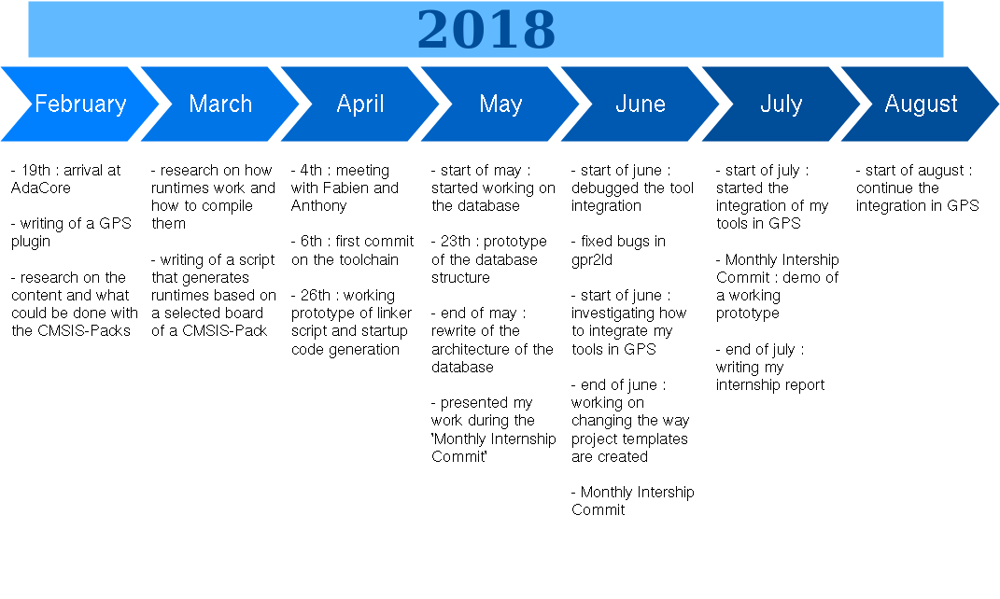

% Internship Report Abstract
% Corentin Gay GISTRE 2018
  Intenship Mentor : Anthony Leonardo Gracio
% From 19/02/2018 to 24/08/2018 (6 months)

---
fontsize: 12pt
fontfamily: utopia
graphics: true
---

# Presentation

AdaCore is a company specializing in compiler technology. They develop and
maintain an Ada compiler named GNAT. They target embedded targets with or
without operating systems. They offer technical expertise to their clients,
allowing them to easily inquire about existing features or report technical issues.

The team I worked in is called the IDE team. Its goal is to maintain and
develop the Ada IDE of AdaCore called GPS (GNAT Programming Studio). This IDE
integrates multiple tools specific to Ada, allowing developpers to be more
efficient in their work.

My mentor is Anthony Leonardo Gracio. He handles all the graphical display of
the IDE. He is an former EPITA student. I also interacted a lot with Fabien
Chouteau (also a former EPITA student) that is part of the 'bare-board' team.
He handles work related to embedded devices and makes sure that the AdaCore
products are working on the different platforms that the clients use.

My work was focused on improving the bare-metal[^fn] support in GPS. Bare-metal
development in Ada requires more work than in C because Ada code needs a
runtime in order to compile and run. An Ada runtime implements the
functionalities of the language such as multi-tasking support or memory
allocation.

[^fn]:'bare-metal' : Describes platforms without an operating system

In order to target a new platform, one must recompile a runtime adapted to the
platform. This is something that is extremely repetitive. For example, the code
behind the runtimes was the same, it was just compiled differently.

We want to avoid having to do that work each time. So, I settled on using the
CMSIS-Packs. It is a standard designed by ARM that describes harware and
software of a device family using the Cortex-M processors. Using the
information in those packs, we can generate the code that is specific to our
target. In our case, we generate two files. First, a linker script describing
how the executable
is to be mapped in physical memory. Second, an assembly file called the
'startup code' that takes care of initializing memory regions before the
execution of the user program. The final goal was to be able to start
developping on a board from GPS right away without having to look up
documentation to configure the different files.

I was expected to have some knowledge bare metal programming and how compilers
work. I was also expected to know how to present my work as we had monthly
intern presentations. I needed to be able to research efficiently and be able
to design program architectures. Finally, I needed to be able to communicate
efficiently with my colleagues as I had to integrate the project that I had made
in the work of other people.

I demonstrated my working prototype in the start of july during my monthly
presentation. I am currently working on integrating my work into GPS.

# Intenship Schedule

The first phase of my internship was a research phase. Thus. I did not plan a
weekly schedule. Here is the the schedule :

# General appreciation

I really enjoyed my time at AdaCore. I had great colleagues to which
I could ask technical questions and get great answers. I could even contribute to the
code of the project the team was maintaining. When I found bugs, I reported
them and made sure the fix worked on my machine.

# Skills acquired during the internship

I acquired a lot of knowledge regarding compiler technologies. I also learned
how to better code in Ada as I only had a basic understanding of the language
features. I imporved my skills at reading unfamiliar code. When I discovered a
bug in the tools I was using, I peeked in the code in order to understand the
different systems working together and where the bug was coming from. I learned
a lot doing that and I found it really enjoyable.

# Conclusion

I had a very positive experience at AdaCore. I learned a lot and they work with great
clients on amazing projects[^fn]. During my internship, I candidated for an
open position they had. I received an offer that I accepted and I plan on
starting by the end of September

[^fn]:To have an overview of their work, go \href{https://www.adacore.com/industries}{here}

