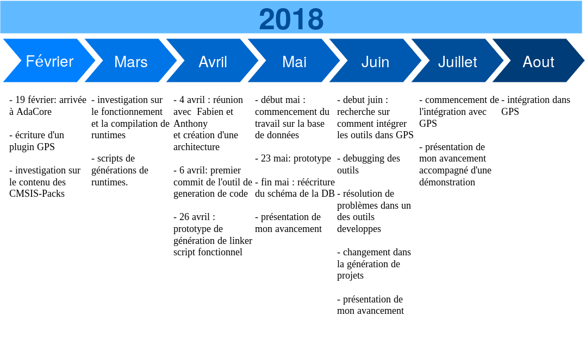
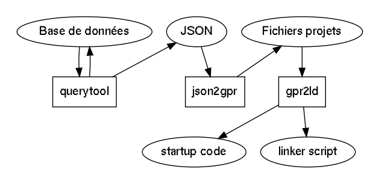
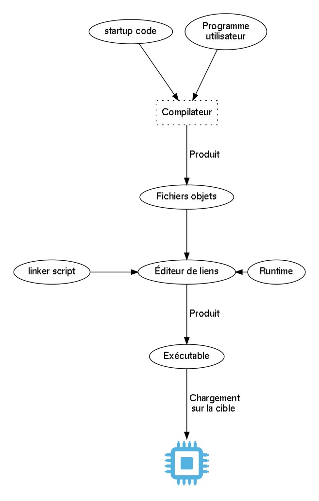
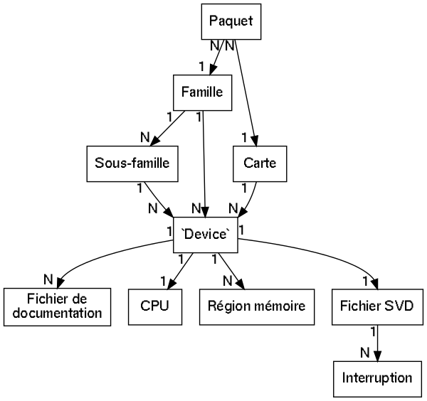

% Rapport de stage de fin d'études
% Corentin Gay GISTRE 2018
  Maître de stage : Anthony Leonardo Gracio
% Du 19/02/2018 au 24/08/2018 (stage de 6 mois)

---
fontsize: 12pt
fontfamily: utopia
glossary: true
graphics: true
biblatex: true
lof: true
link-citations: true
header-includes:
    - \usepackage{hyperref}
    - \usepackage[toc,section=section]{glossaries}
    - \makeglossaries
    - \newglossaryentry{bare-metal}{name=bare-metal,
       description={Un programme dit `bare-metal` (littéralement `métal nu`)
	   est un programme qui tourne sur du matériel sans système d'exploitation}}
    - \newglossaryentry{IDE}{name=IDE,
       description={(Integrated Development Environment) Programme qui facilite
       le développement informatique en intégrant plusieurs outils dans le même
       environnement}}
    - \newglossaryentry{runtime}{name=runtime,
       description={Bibliothèque nécessaire pour faire tourner du code Ada sur
       une cible, elle fournit certaines fonctionnalitées du langage}}
    - \newglossaryentry{GNATCOLL}{name=GNATcoll,
       description={(GNAT Components Collection) Bibliothèque Ada fournissant
       du code permettant d'utiliser des bibliothèques externes. Par
       exemple, GNATCOLL fournit une API pour interragir avec une base de
       données.}}
    - \newglossaryentry{linker script}{name=linker script,
       description={Fichier décrivant à l'éditeur de lien comment arranger la
       cartographie mémoire dans l'exécutable final.}}
    - \newglossaryentry{startup code}{name=startup code,
       description={Aussi appellé 'crt0', c'est le bout de code qui initialise
	   la mémoire et qui appelle le point d'entrée du programme}}
    - \newglossaryentry{plugin}{name=plugin,
       description={Logiciel qui se greffe à un logiciel hôte et qui permet
       d'étendre les fonctionnalités de ce dernier}}
    - \newglossaryentry{boilerplate}{name=boilerplate,
       description={Se dit d'une fonctionnalité ou d'un programme dont le code
       source est quasiment le même quel que soit le programme}}
    - \newglossaryentry{generator functions}{name=fonctions génératrices,
       description={Fonction qui sauvegarde son état interne pour pouvoir
       reprendre l'execution lors d'un prochain appel}}
    - \newglossaryentry{pull-request}{name=pull-request,
       description={Requète pour qu'un projet incorpore des modifications
       tierces dans le code}}
    - \newglossaryentry{DoD}{name=DoD,
       description={'Department of Defense' Département de la Défense des États-Unis}}
    - \newglossaryentry{DO-178}{name=DO-178,
       description={Standard fixant les règles s'appliquant aux logiciels
	   critiques dans l'aviation commerciale et générale. Ce standard fixe des
	   niveaux de criticité en fonctions des conséquences liées au
	   dysfonctionnement d'un sous-système. Chaque niveau de criticité est
	   ensuite lié à des contraintes dans le processus de développement}}
    - \newglossaryentry{DAL}{name=DAL,
       description={Niveau d'Assurance de Développement, c'est le niveau de
	   criticité d'un sous-système allant de A (le plus critique) à E (le moins
	   critique). Par exemple, le système de pilotage d'un avion serait DAL A
	   tandis que le système de divertissement des passagers serait DAL E}}
    - \newglossaryentry{ISS}{name=ISS,
       description={(International Space Station) Station Spatiale Internationale}}
    - \newglossaryentry{RAM}{name=RAM,
       description={(Random Access Memory) mémoire vive accessible en écriture
	   et en lecture}}
    - \newglossaryentry{ROM}{name=ROM,
       description={(Read Only Memory) mémoire accessible uniquement en lecture}}
    - \newglossaryentry{PE}{name=PE,
       description={(Product Engineering) C'est le cercle responsable de la
	   maintenance et de l'amélioration technique des produits d'AdaCore}}
    - \newglossaryentry{ZFP}{name=ZFP,
       description={(Zero Foot Print) C'est la runtime la plus minimale (en
	   termes de taille et de fonctionnalités) pour faire tourner du code Ada}}
    - \newglossaryentry{stack}{name=stack,
       description={Zone mémoire utilisée pour l'allocation mémoire statique}}
    - \newglossaryentry{heap}{name=heap,
       description={Zone mémoire utilisée pour l'allocation mémoire dynamique}}
    - \newglossaryentry{SVD}{name=SVD,
       description={Fichier XML décrivant les périphériques d'une carte et leur
	   agencement mémoire}}
    - \newglossaryentry{GPRbuild}{name=GPRbuild,
       description={Outil d'AdaCore qui permet de decrire un projet et de le
	   compiler avec les options specifiees}}
    - \newglossaryentry{gerrit}{name=Gerrit,
	  description={gerrit est un outil permettant de gérer des dépôts Git et de
	  faire des revues de code depuis une interface web}}
    - \newglossaryentry{realtime}{name=temps-réel,
	  description={Dans l'informatique, se dit de systèmes qui doivent respecter
	  des contraintes temporelles}}
    - \newglossaryentry{machine analytique}{name=machine analytique,
	  description={Machine à calculer programmable conçue au 19ème siècle par
	  Charles Babbage. Elle ne sera pas réalisée de son vivant}}
    - \newglossaryentry{BSP}{name=BSP,
	  description={(Board Support Package) Collection de bibliothèques qui
	  permettent d'utiliser les fonctionnalités de la carte ciblée}}
    - \newglossaryentry{Kanban}{name=Kanban,
	  description={Méthode d'organisation qui trie les taches à faire en trois
	  catégories 'A faire', 'En cours' et 'Terminée'}}
    - \newglossaryentry{Ravenscar}{name=Ravenscar,
	  description={Runtime Ada implémentant plus les fonctionnalités du
	  langage. Plus complète que les runtimes ZFP}}
---

# Résumé

J'ai découvert Ada lors des cours à l'EPITA donnés par Raphaël Amiard. J'ai
trouvé le langage très intéressant car l'emphase placée sur la lisibilité et la
validité du programme tout en gardant des bonnes performances m'intéressent grandement.

J'ai découvert le domaine des applications critiques pendant ma scolarité à
l'EPITA. Étant donné que beaucoup de clients d'AdaCore sont dans ce secteur,
j'ai pensé que c'était une superbe opportunité de pouvoir en apprendre plus sur
ce domaine.

De plus, le fait d'avoir à intégrer mon travail dans une base de code
préexistante me paraissait être une bonne expérience. Ce point me
semble important car il permet de comprendre le contexte technique dans lequel
sera utilisé mon travail. Le sujet de stage me permet de toucher
à plusieurs technologies tout en restant dans mon domaine de prédilection, le
développement embarqué. Par exemple, en apprendre plus sur les différents
processeurs ARM et leurs assembleurs me paraissait être une bonne
expérience à avoir.

C'est pour ces différentes raisons que j'ai candidaté chez AdaCore.

J'ai commencé mon stage le 19 février, j'ai d'abord été accueilli par mes
collègues et ma première tâche a été d'écrire un plugin Python pour l'\gls{IDE}
d'AdaCore, GPS (GNAT Programming Studio). Le but de cette tâche était de
me familiariser avec le système de revue de code ainsi qu'avec le code de
GPS. J'ai ensuite commencé à étudier mon sujet de stage et comment
nous pourrions améliorer le support du \gls{bare-metal} dans GPS.

Beaucoup de programmation Ada se fait dans le domaine du \gls{bare-metal}.
L'absence de système d'exploitation permet de simplifier le processus de
certification car il y a moins d'intermédiaires entre le programme et la
machine physique.

Après avoir développé deux prototypes explorant le sujet, nous avons fait une
réunion avec mes encadrants afin de décider de la suite du stage et nous avons
ainsi décidé d'une architecture pour les outils que j'allais développer.

J'ai commencé à travailler les différents outils de l'architecture. Une fois
que les outils étaient assez avancés pour fonctionner ensemble nous avons
commencer à travailler sur l'intégration de mon travail dans GPS.

Mon stage s'est très bien déroulé et j'ai pu présenter une démonstration de mon
projet durant l'avant dernier mois de mon stage.

# Introduction

## Rappel du sujet de stage

Mon sujet de stage s'intitulait 'Améliorer le support du \gls{bare-metal} dans
GPS'. Le développement \gls{bare-metal} se réfère à du développement logiciel
visant des plates-formes sans système d'exploitation. Ce genre de logiciel est
surtout trouvé dans les domaines critiques ou la présence de système
d'exploitation est un frein a la certification.

Mon stage comportait les axes potentiels suivants:

1. On peut décrire les périphériques d'une carte avec des fichiers \gls{SVD}.
 Depuis ces fichiers, on peut générer des en-têtes Ada décrivant les
 périphériques et leur agencement mémoire avec des structures associées.
 L'objectif de ce sujet est de créer une vue dans GPS qui serait capable
 d'afficher les valeurs des différents champs des périphériques. L'ajout
 de cette fonctionnalité permettrait de grandement simplifier le débugging
 sur les plates-formes embarquées. Par exemple, on pourrait rajouter des points
 d'arrêts conditionnels depuis cette vue.

2. Les CMSIS-Packs sont des archives permettant de décrire le materiel d'une
 plate-forme ainsi que des logiciels l'accompagnant. Par exemple,
 STMicroelectronics distribue un paquet decrivant la famille STM32. Dans ce
 paquet on trouve des exemples de code, des pilotes, des descriptions de
 hardware et de la documentation. Cet axe visait a investiguer comment on
 pourrait utiliser les CMSIS-Packs pour ameliorer l'experience de developpement
 \gls{bare-metal} dans GPS.

3. GPS permet d'afficher le contenu et la taille de la \gls{stack}. Une
 piste de ce stage était d'améliorer cette fonctionnalité afin de donner plus
 de details sur le contenu de la stack.

J'ai choisi de m'intéresser à la deuxième option. L'idée était d'investiguer ce
qu'il était possible de faire grâce aux CMSIS-Packs pour rendre la programmation
embarquée en Ada plus facile d'accès.

Pour pouvoir exécuter du code Ada sur une cible donnée, il faut
avoir une bibliothèque appellé une runtime. Ce logiciel implémente des
fonctionnalités du langage qui sont utilisées par le programme de l'utilisateur
comme le support multi-tâches, la propagation des exceptions ou les allocations mémoires
dynamiques.

Étant donné que la runtime doit tourner sur la cible, il
faut adapter la runtime à chaque cible. Actuellement, c'est une étape qui est
faite manuellement. Il faut également savoir qu'il y a plusieurs types de
runtime qui ne fournissent pas toutes les mêmes fonctionnatlités. Dans le cas
de mon stage nous avons considéré la question des runtimes dites \gls{ZFP}.
Ce type de runtime est le minimum pour pouvoir faire tourner
du code Ada. Par exemple, cette runtime n'a pas de propagation d'exception, pas de
support multi-tâches et ne possède qu'un allocateur mémoire basique.

Les runtimes simplifient le processus de certification de programmes Ada en ne
fournissant que des fonctionnalités minimes. Elles réduisent également le coût
de ces certifications qui peuvent rapidement coûter très cher. De plus, la
propagation d'exception requiert l'utilisation de la \gls{heap} ce qui n'est
pas acceptable dans certains contextes.

Dans le cas décrit ci-dessus, les modifications à effectuer dans le code de la
runtime elle-même sont nulles. Cependant, il faut tout de même modifier le
\gls{startup code}. Ce bout de code permet d'initialiser la mémoire et se charge
d'appeler le point d'entrée du programme. Il faut également modifier le
\gls{linker script}. Ce fichier permet de spécifier les zones mémoires et quelles
portions du code y mettre.

Ces modifications dépendent de la cible et nécessite actuellement de lire la
documentation afin de récupérer les informations nécessaires. Dans le cas où on travaille
avec un processeur cortex-m, ARM a créé un standard qui permet de décrire
le matériel d'une carte ou d'un `device`. Ces infos dans une sont stockées
archive zip. On appelle ces archives des CMSIS-Packs.

La solution est donc d'utiliser les CMSIS-Packs pour automatiser le processus de
modification du \gls{startup code} et du \gls{linker script}. Cette automatisation
permet à l'utilisateur de choisir sa carte de développement lors de la
création d'un projet.

## Présentation de l'entreprise
### Historique

En 1975, le \gls{DoD} commença à rédiger un standard décrivant un langage visant à
remplacer les 450 langages utilisés à l'intérieur de l'organisation.
En 1978, le dernier standard appelé 'Steelman' est finalisé. Le \gls{DoD} organisa
ensuite un concours visant à trouver le langage implémentant au mieux le standard
Steelman. Ce langage allait remplacer les 450 langages utilisés par le \gls{DoD}.
Quatres équipes sont créées et parmis elles, c'est l'équipe
'Green' qui remporte le concours. Le langage 'Green' est rebaptisé 'Ada'.
Ce langage est nommé en hommage à Ada Lovelace, mathématicienne anglaise du
19ème siècle. Elle est considérée comme le premier programmeur, ayant écrit un
programme pour la \gls{machine analytique} de Charles Babbage.

J'ai beaucoup appris sur ce sujet en consultant le site de Mary Van Deusen[^fn]
qui explique comment la compétition s'est déroulée.

[^fn]:Lien vers le \href{http://iment.com/maida/computer/redref/index.htm}{site} en question

En 1992, l'université de New York conclut un contrat avec l'US Air Force afin
de créer un compilateur libre afin d'aider à la diffusion du
nouveau standard Ada 9X (qui deviendra Ada 95).
Suite a ce projet, la société Ada Core Technologies est créée à New York et la
sociétée sœur ACT-Europe est créée deux années plus tard. Ce n'est qu'en 2012
que ACT-Europe rachète Ada Core Technologies pour ne former plus qu'une seule
entreprise, AdaCore.

AdaCore vend un compilateur Ada appellé GNAT. Ce compilateur est distribué
en plusieurs versions, chacune visant un public différent.
Par exemple la version `Community` ne supporte que la dernière version du
standard Ada, Ada 2012, et vise principalement les développeurs amateurs.

La version `Assurance` est destinée aux projets de certifications ou à des
projets de longues durées et supporte jusqu'à Ada 83. Elle permet aussi de ne pas
avoir à soumettre le code produit à la license GPL, qui obligerait
l'utilisateur à rendre le code public.

AdaCore fournit à ses clients un support de qualité. Ce support
permet aux clients de communiquer directement avec un ingénieur qualifié qui
travaille sur les outils qu'utilisent le client. Cela permet de réduire le
nombre d'intermédiaires et permet aux clients d'avoir des réponses rapides et
claires à leurs interrogations ou à leurs problèmes.

Une partie importante d'AdaCore est le support des logiciels open-source. C'est
a dire les logiciels dont le code source est ouvert au public. Cette demarche
garantit aux clients une transparence dans les modifications apportées par
AdaCore au compilateur. Régulierement, les patchs et les bugs trouvés dans GCC
sont communiqués à la FSF (Free Software Foundation) qui maintient GCC.

Pour aller avec le compilateur, AdaCore peut également aider les clients avec
des projets de certifications. En effet,
une partie des outils fournis par AdaCore, comme GNATcoverage, sont qualifiés
pour le développement d'outil en \gls{DO-178}B en \gls{DAL} A. C'est à dire le niveau de
criticité le plus élevé du standard avionique. GNATcoverage aide à
l'analyse de couverture de code ce qui permet de garantir qu'il n'y a pas de
code qui n'est jamais testé.

AdaCore a beaucoup de clients dans des domaines critiques,
comme l'avionique ou le secteur de la défense.
Voici deux exemples de projets menés par des clients d'AdaCore :

- MDA, une division de Maxar Technologies, va utiliser Ada ainsi que le produit
  GNAT Pro Assurance afin de remplacer le logiciel en charge de la
  communication espace-terre à bord de l'\gls{ISS}.

- Real Heart AB est une entreprise suédoise qui travaille sur un coeur totalement
  artificiel. Afin de garantir le bon fonctionnement du logiciel qui pilote le
  moteur de la pompe du coeur, elle a choisi d'utiliser Ada ainsi
  que le compilateur GNAT Pro fourni par AdaCore.

\newpage

### Contexte concurrentiel

AdaCore n'est pas la seule entreprise  dans le domaine des compilateurs Ada.
Voici un rapide aperçu des principaux compilateurs concurrents.

                          Green Hills Ada Compilers
---------------------     -----------------------------------------------------
Entreprise                Greens Hills Software
Standards                 Ada95
Plates-formes cibles      Power, ARM/Thumb, 68k, MIPS, x86, SPARC
Runtime                   \gls{Ravenscar} (non multitâche)
---------------------     -----------------------------------------------------

                          ObjectAda
---------------------     -----------------------------------------------------
Entreprise                PTC
Standards                 Ada95 Ada2012 (windows 10 natif) &nbsp; &nbsp; &nbsp; &nbsp; &nbsp; &nbsp; &nbsp; &nbsp; &nbsp; &nbsp;
Plates-formes cibles      PPC, x86
Runtime                   \gls{Ravenscar}
---------------------     -----------------------------------------------------

Par rapport à ses concurrents, GNAT Pro a l'avantage de supporter la dernière
version du standard Ada (Ada 2012) ainsi que toutes les versions antérieures, et
ce tout aussi bien sur des plates-formes natives qu'en compilation croisée.
GNAT Pro supporte également bien plus de plates-formes 64bits et supporte
également plus de systèmes d'exploitation \gls{realtime}s comme PikeOS, LynxOS
ou le plus commun VxWorks. On peut donc en conclure que même si AdaCore a de la
compétition, elle reste première dans son domaine.

### Organisation

AdaCore est organisée en cercles. Chaque cercle a une responsabilité bien
particulière. Dans mon cas, j'ai intégré le cercle \gls{PE} (Product Engineering).
Ce cercle est responsable de créer, de faire évoluer et de maintenir les
produits d'AdaCore. Il est également responsable du support client pour les outils qu'il
maintient. C'est la force du support offert d'AdaCore, de pouvoir contacter
directement les personnes qui ont une expertise forte sur les produits qu'ils
maintiennent. Ce cercle s'occupe aussi
de la QA (Quality Assurance) et des partenariats de contrats de recherche.

Au sein de ce cercle j'ai intégrer le sous-cercle \gls{IDE}. Son rôle est de s'occuper de
l'\gls{IDE} (GPS) ainsi que des bibliothèques périphériques. Par exemple, cette
équipe s'occupe de l'intégration de GNAT dans l'\gls{IDE} de WindRiver (Workbench)
afin de pouvoir facilement faire tourner des applications en Ada sur les
différentes versions de VxWorks, un OS propriétaire très utilisé dans le
domaine du \gls{realtime} embarqué. J'ai également beaucoup interragi avec l'équipe
CROSS. Cette équipe s'occupe de porter la suite d'outils GNAT vers de nouvelles
plates-formes. Ces plates-formes ont parfois des spécificités qui demandent la
modification des outils.

Dans ce contexte j'ai surtout interagi avec l'équipe GPS dont mon maître de
stage fait partie. Comme je devait intégrer mon travail dans GPS, cela a été
très utile de pouvoir communiquer facilement avec les personnes qui
travaillent sur l'outil. J'ai également beaucoup travaillé avec un membre de l'équipe
CROSS qui a été à l'origine de mon sujet de stage. Il a pu me guider lorsque
j'avais des questions techniques vis-à-vis des runtimes Ada.

## État des connaissances sur le sujet

J'avais déjà utilisé les runtimes Ada pour un projet embarqué
dont le but était d'interfacer du code C++ avec du code Ada. Mon expérience
avec l'Ada était donc plutôt limitée et je voulais profiter de ce stage pour en
apprendre plus sur ce langage.

Au cours de mon cursus, je n'ai pas beaucoup utilisé Python. Cependant, je
l'utilise sur mon temps libre pour personnaliser certains aspects de ma
distribution Linux, je n'étais donc pas complètement novice sur ce sujet.

J'ai l'expérience de plusieurs projets à l'EPITA concernant l'assembleur, mon
premier projet ayant été le projet assembleur en ING1 qui touchait surtout
l'assembleur x86. En GISTRE, j'ai fait un peu d'assembleur ARM grâce au
projet ARM. Enfin, lors de mon projet de fin d'études, j'ai dû lire de
l'assembleur 8080 afin de débugger notre émulateur Gameboy. Je voulais
profiter de mon stage pour en apprendre plus sur les différentes architectures
ARM.

## Maturité et intérêt du stage pour l'entreprise

Côté embarqué, AdaCore possède beaucoup de ports différents. GNAT Pro
supporte des OS dits \gls{realtime} comme VxWorks ou LynxOS et supporte
également des cibles \gls{bare-metal}, c'est à dire des cibles sans OS.

L'\gls{IDE} d'AdaCore (GPS) permet de faciliter le développement embarqué en
fournissant une interface de connection à la carte facile d'utilisation.
Cependant, GPS ne supporte pas les CMSIS-Packs dans son état actuel, ce qui
rend difficile le développement embarqué sur une carte non supportée.

En effet, dans le cas précédent, l'utilisateur doit compiler sa propre runtime,
son propre \gls{linker script} et son propre \gls{startup code}. Dans les cas
des runtimes dîtes Ravenscar qui contiennent beaucoup de code dépendant des
composants de la carte, ce qui complique le travail de l'utilisateur.
Contrairement au C/C++ qui sont supportés par beaucoup d'outils, le support de
l'Ada est inexistant dans le cadre des CMSIS-Packs.

L'intérêt du stage est donc clair pour AdaCore : la simplification du processus
de développement permet d'enlever une barrière à l'adoption de GPS et à
l'adoption d'Ada.

## Contexte de travail

J'ai pu rapidement me mettre à travailler efficacement grâce à la
documentation interne. De plus, la disposition physique des locaux m'a permis,
lorsque j'avais des questions complexes, d'aller voir directement la personne
concernée afin d'obtenir une réponse claire.

J'était encadré par deux anciens épitéens, Anthony Leonardo Gracio et Fabien
Chouteau. Anthony fait partie de l'équipe GPS et m'a
aidé à intégrer mon code dans GPS et à écrire du meilleur code en faisant les
revues sur le code que j'écrivais. Fabien fait partie de l'équipe \gls{bare-metal} et
c'est lui qui est à l'origine de mon sujet de stage. Il m'a aidé lorsque
j'avais des questions vis à vis de certaines technologies ou du
fonctionnement d'Ada dans le domaine de l'embarqué.

Concernant le sujet du stage, un collègue avait déjà réalisé un prototype
utilisant les CMSIS-Packs, j'ai pu m'en inspirer afin d'avancer plus vite
dans mon travail. De plus, la grande disponibilité de mes deux encadrants m'a permis
d'avancer vite et de ne pas rester bloqué sur des problèmes qu'ils pouvaient
m'aider à resoudre.

Pour comprendre comment fonctionnaient les runtimes et à quels problèmes elles
répondaient, j'ai consulté Fabien qui m'a recommandé la lecture des articles
suivants :

- [@bareboardkernelada2005] Cet article explique comment implémenter certaines
  fonctionalités d'un noyau temps réel dans une runtime Ada.

- [@adarealtimeclock] Cet article plus spécialisé explique comment implémenter
  des services de mesure du temps dans un noyau temps-réel.

Lorsque j'ai commencé à tester mon travail, j'avais trois cartes
différentes à ma disposition :

- une STM32F420
- une SAMD20
- une SAM4E

Toutes ces cartes avaient des moyens de communication ou des
CPUS différents afin de me permettre de tester le code que je produisais sur le
plus de cibles variées.

En termes de logiciels utilisés, j'ai principalement utilisé la bibliothèque
standard Python 2.7, ainsi qu'une bibliothèque Ada nommée \gls{GNATCOLL}.
Cette bibliothèque fournit beaucoup de
fonctionnalités, mais je l'ai principalement utilisée pour modifier et lire les
fichiers dits projets. Ces fichiers servent à décrire la structure d'un
projet Ada et j'ai utilisé le même formalisme afin de décrire les informations
nécessaires pour décrire une carte.

# Aspects organisationnels
## Découpage du stage
### Périodes du stage

Pour m'organiser, je notais mes tâches à faire dans un journal. Lorsque je trouvais un
bug ou une fonctionnalité à implémenter, je demandais l'avis de mon maître de
stage. Dans le cas où la tâche était en lien avec mon stage ou simple, je
l'ajoutais à ma liste de tâches en cours. Sinon, je créais un ticket pour
l'équipe qui était concernée.

J'ai choisi de ne pas m'organiser avec un diagramme de Gantt. La
première phase de mon stage était de la recherche et requiérait une
organisation évolutive. J'ai passé donc beaucoup de temps à explorer les
différentes possibilités ce qui n'était pas compatible avec un diagramme de
Gantt.

Voici un schéma présentant les tâches que j'ai réalisé et dans quel ordre.



#### Écriture d'un plugin GPS

Le livrable de cette étape est un patch permettant de lancer l'émulateur avec
les harnais de tests. Il a été revu et testé en utilisant \gls{gerrit}.

#### Scripts de génération de runtimes

Les livrables de cette étape sont :

- un script permettant de générer un projet en C pour une carte contenue
  dans un CMSIS-Pack valide
- un script permettant de générer une \gls{runtime} ciblant une carte contenue
  dans un CMSIS-Pack valide

#### Architecture

Le livrable de cette étape est un document d'architecture décrivant les différents
outils et comment ils interagissent entre eux.

#### Développement des outils de génération de code

Les livrables de cette étape sont :

- un outil permettant de générer le \gls{startup code} et le \gls{linker script}
- un outil permettant d'interagir avec la base de données
- un plan de base de données représentant les informations nécessaires à le
  génération de code

#### Intégration dans GPS

Les livrables de cette étape sont :

- un script d'installation pour les outils
- un patch modifiant la façon dont les projets sont créés dans GPS

### Procédures qualité

Voici une présentation des différentes procédures qualité que j'ai suivi, la
plupart étant communes au cercle \gls{PE}.

En premier lieu, chaque patch doit avoir un numéro de ticket associé. Cela
permet de trouver facilement les bugs et de comprendre pourquoi un patch a été
fait. Par exemple, dans le cas d'un bug introduit dans un patch, avoir le
numéro de ticket permet de savoir quel était le but du patch et quel
comportement adopter face au problème, que ce soit le retrait du patch ou la
modification de ce dernier.

Le code écrit doit suivre les règles de codage d'AdaCore. Ces règles permettent de
standardiser le code et le rendant plus facile à maintenir. Dans l'équipe où j'étais,
les rêgles de codage pour le langage Python étaient vérifiées
automatiquement par un outil appellé pep8 (de la règle de codage PEP 8).
L'équipe utilise également un autre outil appelé pyflake qui permet de vérifier
certains aspects des règles de codage que pep8 ne vérifie pas.
Dans le cas où le code n'est pas conforme à cette règle, l'outil de
versionement refuse d'envoyer le patch.

Une fois que le patch est prêt, il faut l'envoyer sur \gls{gerrit}. Cet outil permet
faire des revues de code et lance la suite de tests du projet associé au patch.
La revue de code est faite par un pair qui connait le sujet de patch. Cette
revue permet de s'assurer que le code est facilement lisible par un humain.
L'examinateur peut anoter le code afin de spécifier les endroits manquants de
documentation ou les endroits où un bug pourrait arriver.

Lorsqu'un patch est envoyé sur \gls{gerrit}, des tests automatiques sont lancés. Le
résultat des tests est ensuite affiché sur la page des test, ce qui permet au
développeur de trouver les problèmes dans son patch. Pour qu'un patch soit
accepté dans le code il faut que les tests automatiques soient validés
et qu'une personne ait revu le code.

## Points de contrôle

J'ai eu plusieurs points de contrôles pour faire le point sur mon avancement et
m'aider à prioriser mes tâches.

Avec mon maître de stage, nous avons fait des points réguliers sur mon
avancement. Au début de mon stage, nous en faisions toutes les semaines pour me
permettre d'avancer vite et ne pas rester bloqué. Ces points m'ont permis de
prioriser mes tâches afin de me concentrer sur celles qui étaient importantes.
Lorsque j'ai commencé à
travailler sur les différents outils, nous avons fait un point toutes les deux
semaines, ce qui m'a permis d'avancer plus vite qu'en faisant un point toutes
les semaines. En effet, suivre une architecture prédéterminée rendait le
travail d'implémentation plus simple en réduisant le nombre de questions que
j'avais.

L'équipe GPS fait une réunion d'avancement chaque semaine. Pendant cette
réunion chaque membre parle de ses tâches en cours de leur avancement. L'équipe
\gls{bare-metal} fait la même chose chaque semaine. Participer à ces réunions m'a
permis de discuter de mon avancement et de récupérer des suggestions et des
conseils concernant mes tâches en cours. Par exemple, cela a permis à certains
de mes collègues de contribuer au code des différents outils sur lesquels je
travaillais.

Tous les mois, AdaCore organise des "Monthly Interns Commits". Ce sont des
présentations durant lesquelles les stagiaires d'AdaCore présentent leur
avancement et les problèmes qu'ils ont rencontrés. Ces séances m'ont permis de
présenter mon travail et situer le contexte de mon stage. Les retours de
mes différents collègues m'ont permis d'améliorer ma présentation et comment je
présentais mon sujet de stage.

Enfin les revues de code sur GitHub et \gls{gerrit} m'ont permis de corriger mes
erreurs et d'améliorer mon code.

## Gestion des problèmes

Dans le cas de mon stage, nous générions du code à partir de fichiers de
configurations. Lors de l'intégration de mon travail dans GPS, nous aurions
aimé pouvoir relancer la génération de code automatiquement si l'utilisateur
modifiait les fichiers de configuration.

Nous avons donc discuté de cette idée avec les personnes s'occupant de l'outil
de compilation (\gls{GPRbuild}). Cependant, du aux limitations de l'outil de compilation,
nous ne pouvions pas lancer l'outil automatiquement en cas des modifications
des fichiers de configuration par l'utilisateur. L'utilisateur devrait relancer
la génération de code manuellement dans un terminal. Pour pallier à ça, nous
allons rajouter un bouton dans l'interface graphique de GPS qui
permettrait de relancer la génération de code.

# Aspects techniques

## Faire fonctionner les harnais de test avec GNATemu
### Objectifs

GPS possède un outil appellé GNATtest. Cet outil permet de générer un projet
qui va se charger de tester les fonctions d'un autre projet, ce sont les
harnais de test.

Dans GPS, pour un projet embarqué, il est possible de lancer
le projet sur un émulateur : GNATemu.
Il utilise l'émulateur libre QEMU afin d'émuler le CPU de la cible.
GNATemu utilise GNATbus afin d'émuler des périphériques sur un bus (AMBA ou PCI)
afin de pouvoir simuler une carte embarquée.

L'objectif de cette tâche était de pouvoir exécuter le harnais de test sur
l'émulateur dans le cas d'un projet embarqué.

GNATtest était déjà intégré dans GPS avec un \gls{plugin}. Il fallait modifier
ce dernier dans le cas où le code était compilé pour une carte embarquée.

### Cadre de la tâche

Ce \gls{plugin} doit donc être développé en
Python. Nous avons utiliser \gls{gerrit} pour que je me familiarise avec le
système de revues de code.

### Résultats obtenus et impact sur l'avancement du stage

Le plugin GPS a été modifié pour tenir compte de la cible et permet de lancer
la suite de test sur l'émulateur. J'ai utilisé les bibliothèques de workflows
python pour rendre mon code asynchrone. J'ai également utilisé les
\gls{generator functions} pour rendre mon code plus efficace.

J'ai refactoré le code qui servait à lancer l'émulateur afin de permettre
l'appel des fonctions depuis d'autres modules python.

Ce \gls{plugin} possède néanmoins une limitation.
Normalement, lorsque des tests échouent, GPS peut afficher directement quel test
échoue et à quelle ligne. Nous avons ce comportement lorsque l'on lance
l'émulateur sur un harnais de test. Cependant, lorsque l'on lance l'émulateur
sur une liste de harnais de test, GPS ne peut pas récupérer les différentes
sorties et ne peut donc pas les afficher correctement. Nous avons
donc decider de les afficher dans une console, une par harnais de test.

Ce projet m'a permis de me familiariser avec l'API des \gls{plugin}s Python
dans GPS. J'ai pu également aussi prendre en main le système de revue de code.

## Prototypes de générations de runtimes
### Objectifs

L'objectif principal était de me familiariser avec le comportement des runtimes
Ada et de comprendre leur fonctionnement. Je devais également explorer ce qu'il était
possible de faire avec les CMSIS-Packs et comment nous pouvions les utiliser
dans le contexte de la programmation embarqué Ada.

Le rôle du script est de générer une runtime ZFP pour une board spécifique.
Le script doit pouvoir analyser le contenu du fichier et proposer à
l'utilisateur quelle board choisir.

### Cadre de la tâche

Le cadre de cette tâche était plutôt libre, j'ai utilisé Python pour parcourir
le contenu des paquets et générer les fichiers nécessaires.

### Solutions envisagées

En découvrant qu'ARM avait son propre compilateur, assembleur et syntaxe de
linker script (appellés scatter file par l'éditeur de liens ARM), j'ai pensé qu'un
outil transformant la syntaxe ARM en son équivalent GCC pouvait être
réalisable. Cependant, après en avoir discuter avec mon maître de stage il
s'avère que générer les fichiers serait plus simple que les traduire, nous
n'avons donc pas continué avec cette idée. La difficulté principale venait de
la transformation du \gls{startup code} qui demandait une interprétation de certains
éléments du code assembleur car certaines directives ARM n'avaient pas leur
équivalent en assembleur GCC et vice-versa.

### Difficultés rencontrées

Je n'était pas très familier du parsing XML en Python. J'ai donc passé un
peu de temps à comprendre comment récupérer les informations intéressantes dans
le fichier XML.

J'ai également passé du temps à comprendre la structure des CMSIS-Packs.
Le ficher XML peut associer certains de ses composants à des conditions.
Par exemple, le
pack peut faire la distinction entre le compilateur GCC et le compilateur ARM
et peut spécifier quels fichiers utiliser pour un compilateur donné. GNAT est
basé sur GCC, il était donc nécessaire dans notre cas de ne récupérer que les
informations utilisables avec GCC.

### Résultats obtenus et impact sur l'avancement du stage

À la fin de cette tâche, j'avais réalisé deux outils. Le premier outil
sert à générer les fichiers utilisés lors de la compilation comme le
\gls{linker script} ou le \gls{startup code}.

Le second outil génère la structure d'une runtime prête à compiler. C'est à
dire les fichiers projets qui décrivaient à \gls{GPRbuild} comment compiler la
runtime.

Cette tâche m'a permis de comprendre comment étaient agencés les packs et
quelles fonctionnalités pouvaient être utilisées depuis le contenu des packs.
Certains packs possèdent un \gls{linker script} et un \gls{startup code}
compatible avec GCC mais ce n'est pas le cas de tout les packs. Il fallait dont
générer ces fichiers à partir des informations contenus dans les packs.

## Architecture de la chaîne d'outils
### Objectifs

Suite à l'accomplissement de la tâche précédente, j'ai organisé une réunion
avec mes encadrants afin de décider de la prochaine étape à suivre lors du
stage. Nous avons donc décider d'une architecture décrivant les outils
nécessaires au projet.

### Cadre de la tâche

Le cadre de la tâche était de créer des outils portables. Il
fallait donc complêtement décorréler l'intégration dans GPS et le
fonctionnnement des outils. Il fallait pouvoir utiliser ces outils depuis un
terminal ou bien depuis un script Python. Ces outils doivent utiliser les
langages Python et Ada.

### Solutions envisagées

Nous avons décidé de laisser tomber la génération de runtime. En effet, il
existe un projet d'AdaCore appellé \href{https://github.com/AdaCore/bb-runtimes}{`bb-runtimes`}.

Le but de ce projet est de fournir des runtimes spécifiques à un CPU et non à
une carte. Les runtimes actuelles sont distribuees pour une carte specifique.
Avoir des runtimes specifiques aux CPU permettrait de reduire le nombre de
runtimes differentes a maintenir et à isoler le code specifique a un certain
CPU. Les runtimes plus complexes (\gls{Ravenscar}) utilisent un \gls{BSP} pour
interragir avec la carte.
J'allais donc me reposer sur les runtimes de ce projet.

Une partie importante de l'organisation était la séparation du pilotage de la
chaîne d'outils et de l'intégration dans GPS. En effet, on devait pouvoir
intégrer facilement mon travail dans les autres \gls{IDE} supportés par AdaCore.

### Résultats obtenus et impact sur l'avancement du stage

[//]: # (TODO: séparer le schéma en 2, une partie phase de compilation et une
		partie outils)

Pour que la chaîne d'outils soit extensible il fallait que chaque outil soit
clairement définit et qu'il n'accomplisse qu'un rôle, le plus simple possible et
le plus simplement possible.

Il fallait ensuite écrire un script qui allait piloter la chaîne d'outils et
enfin intégrer ce script dans GPS. Il fallait que les outils soient utilisables
depuis la ligne de commande ou comme un module Python. L'architecture retenue
est décrite ci-dessous.



L'outil 'querytool' se charge d'interagir avec la base de données, il permet de
récupérer le contenu des CMSIS-Packs ou d'en rajouter. Dans le cas des
informations relatives à une carte, cet outil génère du JSON qui permet de
décrire le device associé à la carte.

Le JSON est ensuite transformé en deux fichiers projets grâce à l'outil 'json2gpr'.
Ces fichiers projets décrivent le device sélectionné par l'utilisateur.

Ces fichiers projets sont ensuite utilisés par 'gpr2ld' pour générer le \gls{startup
code} et le \gls{linker script}. Ces deux fichiers sont utilisés à
différentes étapes de la compilation pour générer l'exécutable final.



## Base de données
### Objectifs

La base de données doit pouvoir récupérer et organiser toutes les informations
nécessaires à la génération du \gls{linker script} et du \gls{startup code}.
C'est à dire à la fois les
informations liées au CPU et les informations liées à la `board`. Il faut
également stocker la description des interruptions, c'est à dire l'index dans
le tableau d'interruptions ainsi que son nom (pour que l'utilisateur puisse
savoir quelle est la fonction de cet interruption).

Elle doit également contenir le lien auquel un pack peut être téléchargé et
mis à jour. Il est également intéressant de stocker la hiérachie de famille et
de sous-familles afin de permettre, lors de l'intégration, à l'utilisateur de
filtrer les résultats de recherche à la sous-famille de son choix.

Un device représente la puce sur une carte. Tandis que la carte definie les
peripheriques physiques avec lesquels le device peut interragir. Par exemple,
la carte STM32F429-Discovery possède un device STM32F429IG. Il est important de
représenter les deux. En effet, deux cartes peuvent avoir le même device et
nous ne voulons pas de duplicata d'information.

Un device est defini par plusieurs attributs:

- des régions memoires
- des fichiers de documentations
- un CPU
- un fichier SVD

Certains paquets ne respectent pas la hiérarchie famille/sous-famille et
possèdent uniquement des familles. C'est pour cela qu'une famille peut
posséder des sous-familles ou directement des devices.

### Architecture



### Cadre de la tâche

La base de données a été développée en Python en utilisant le module SQLite3
de la bibliothèque standard.

### Difficultés rencontrées

Certains paquets ne respectaient pas la syntaxe XML et j'ai dû les modifier
afin de les rendre conformes à la syntaxe attendue.

### Solutions envisagées

Mon premier schéma de la base de données copiait la façon dont était
structuré le fichier XML et comportait une table avec des éléments qui
référençaient le contenu de leurs parents. Par exemple, pour récupérer toutes
les informations pertinentes à un `device` donné, il fallait récupérer les
informations du device mais aussi celles de la sous-famille et de la famille
associée.

Après relecture du code, j'ai décidé de remplacer cette table par 3 tables
distinctes qui représentaient une famille, une sous-famille et un device.
Toutes les informations nécessaires sont maintenant dans la table représentant
les devices. En effet, la hiérarchie d'information ne change que lors de
l'ajout ou le retrait d'un paquet, il n'était donc pas utile de pouvoir
changer ces informations en cours d'éxécution

### Résultats obtenus et impact sur l'avancement du stage

À la fin de cette tâche, j'avais un design de base de données fonctionnel.
Une fois tous les paquets ajoutés à la base de données, elle faisait une taille
d'à peu près 3 Mo. Étant donné le volume important de device avec un processeur
cortex-m, une base de données de cette taille est acceptable.

## Outil d'interrogation de la base de données
### Objectifs

Le but de cet outil est de fournir une API de communication avec la base de
données. Elle doit permettre de récupérer tous les paquets ainsi que leur
contenu. Elle doit également permettre de récupérer toutes les informations
concernant un device donné.

### Cadre de la tâche

Il faut que cet outil soit utilisable depuis un module python ou depuis la
ligne de commande. Cela permet d'utiliser l'outil depuis un script ou
depuis le code Python. Les informations concernant un device donné sont
affichées dans le format JSON, pour permettre facilement leur interprétation.

### Difficultés rencontrées

En testant cet outil, il est apparu clair que les performances n'étaient pas
suffisantes, en effet, l'outil mettait à peu près trente minutes à rajouter le
contenu de tous les paquets dans la base de données ce qui était beaucoup trop
long.

Il y a plusieurs types d'analyseur syntaxique pour le XML dans la bibliothèque
standard Python. Celui utilisé jusqu'a présent par l'outil
fonctionne en alouant tout le fichier en mémoire pour ensuite pouvoir le
parcourir via des fonctions associées. Dans le cas de l'ajout des
interruptions, le fichier XML les décrivant pouvant faire jusqu'a
soixante-quinze mille lignes, beaucoup de temps était perdu à cause de cette allocation mémoire.
En changeant de méthode pour le parcours des éléments, on peut utiliser un
analyseur différent qui permet de n'allouer que le minimum d'espace mémoire
nécessaire. En spécifiant précisément les éléments de début et de fin de la
partie du fichier qui nous intéresse, cet analyseur nous permet d'analyser les
éléments du fichier pendant son parcours et ainsi d'être beaucoup plus
efficace. En changeant d'analyseur, on passe de trente minutes à un peu en
dessous de trois minutes pour l'ajout du contenu de tous les paquets.
Sachant que c'est une étape qui est faite une fois lors de la configuration de
la base de données, un temps de trois minutes d'attente est largement
acceptable.

### Solutions envisagées

J'ai réécris la façon dont les requêtes étaient faites. Dans la première
version de l'outil, un objet Python faisait des requêtes au fur et à mesure
pour aggréger les résultats.

Cette méthode posait des problèmes de performances. En effet, récupérer les
informations de tous les devices de la base de données prenait quelques
secondes. En modifiant le code pour générer des requêtes à la place de les
faire au fur et à mesure, le code a gagné en efficacité, passant de quelques
secondes à un résultat quasiment instantané.

Pour pouvoir implémenter la suppression de paquets efficacement, il fallait
introduire des scripts qui se déclenchaient lors de certaines actions
dans la base de données. En effet la structure
non-triviale des différentes tables rendait la suppression en cascade
inefficace.

### Résultats obtenus et impact sur l'avancement du stage

Une fois cet outil écrit, il a permis de tester la base de données.
Il a notamment permis de déceler les problêmes de performances liés à l'ajout
des paquets.

## Transformation du JSON en fichiers projets
### Objectifs

Le but de cet outil est de traduire le JSON en syntaxe de fichier projet. Cela
permet de transformer la sortie de l'outil précédent en fichiers projets
représentant le matériel sélectionné.

### Alternatives

Il y avait une alternative qui consistait à ne pas utiliser les
fichiers projet mais plutôt de passer uniquement par du JSON. Cependant, cette
alternative n'a pas été retenue car cela ne permettait pas la modification des
fichiers projets simplement depuis GPS.

### Cadre de la tâche

Comme les autres outils, ce programme doit pouvoir être appelé depuis la ligne
de commande ou depuis un script Python.

### Résultats obtenus et impact sur l'avancement du stage

Une fois cet outil terminé, j'ai pu tester que la chaîne d'outils fonctionnait
correctement.

Voici un exemple de fichier projet décrivant la carte SAMD20 Xplained Pro:

```Ada
project Spec is

   package CPU is
      for Name use "cortex-m0plus";
      for Float_Handling use "soft";
      for Number_Of_Interrupts use "15";
   end CPU;

   package Memory_Map is

      --  MEMORY MAP
      for Memories use ("FLASH", "MEM1");

      for Boot_Memory use "FLASH";

      for Mem_Kind("FLASH") use "ROM";
      for Mem_Kind("MEM1") use "RAM";

      --  ROM
      for Address("FLASH") use "0x0";
      for Size("FLASH") use "256K";

      -- RAM
      for Address("MEM1") use "16#20000000#";
      for Size("MEM1")    use "16#8000#";

   end Memory_Map;

end Spec;
```

Sur l'exemple ci-dessus on peut voir que le CPU gère les nombres à virgules
flottantes avec du logiciel (certaines plates-formes ont des co-processeurs
spécifiques à ce genre d'opérations). Dans l'exemple ci-dessus, la carte
possède deux régions mémoires une \gls{ROM} et une \gls{RAM}. La mémoire de
démarage sélectionnée est la mémoire \gls{ROM}. Le mémoire ROM commence à
l'adresse `0` (en hexadécimal) et a `256` kilo octets de capacité.
La mémoire RAM commence à l'adresse `16#20000000#` (syntaxe Ada pour `20000000`
en hexadécimal) et a une taille de `8000` (en hexadécimal) octets.

Le formalisme précédent permet de gagner fortement en clarté par rapport à un
\gls{linker script}. L'utilisation de la syntaxe des fichiers projets permet
également de profiter des outils utilisant ce format. Par exemple, cela rend la
modification dans GPS plus aisée et permettrait de représenter
graphiquement les différentes mémoires.

## Génération du startup code et du linker script
### Objectifs

Le but de cet outil est de générer un \gls{linker script} et un \gls{startup code}
depuis un fichier projet utilisant le formalisme de la section précédente.
On doit pouvoir rajouter des architectures supportées juste en ajoutant des
fichiers de configuration.

Cet outil doit également s'assurer que le fichier projet est correct. Par
exemple, l'outil doit pouvoir détecter et refuser le fichier projet dans le cas
ou deux sections mémoires sont supperposées.

Dans le \gls{linker script}, chaque section de l'exécutable doit être
mise dans une section mémoire spécifique. Par exemple, la section .text
contenant le code doit être mise dans la région mémoire de démarage afin
d'être exécuté.

### Cadre de la tâche

Cet outil doit être un exécutable indépendant écrit en Ada. Il doit se reposer
sur deux fichiers distincts: un fichier décrivant la mémoire et le CPU et un
autre décrivant le vecteur d'interruptions.

L'outil utilise des patrons de code assembleur afin de générer le code associé
à chaque section. Il doit être possible de rajouter des patrons de code avec
des architectures différentes sans avoir à recompiler l'outil.

### Solutions envisagées

Actuellement, l'outil utilise des patrons de code assembleur afin de générer du
code. Une proposition était d'écrire un langage de
description d'assembleur qui serait ensuite traduit dans l'assembleur cible.

Cette idée n'a pas été retenue car beaucoup trop complexe à mettre en place, à
la place on utilise des patrons de code assembleurs.

### Difficultés rencontrées

Avant ce projet, j'avais écris un court projet en Ada. J'ai donc passé un peu
de temps à me familiariser avec les subtilités du langage. J'ai du utiliser des
bibliothèques Ada pour lire les fichiers projets. La bibliothèque
\gls{GNATCOLL} fourni une interface pour lire des projets et les valider. J'ai
passé du temps à comprendre comment utiliser l'API fournie car elle est très
peu documentée. De plus, les noms de fonction du code étaient mal choisis, ce
qui a ralenti mon travail.
J'ai demandé de l'aide au mainteneur du projet qui
m'a aiguillé sur les bonnes fonctions et qui m'a expliqué certains concepts de
l'API que j'avais mal compris. J'ai pu avancer dans mon travail et j'ai rajouté
un exemple dans la documentation expliquant comment faire ce que je voulais.

Pendant le développement, nous avons d'essayer un processus de développement en utilisant
le site GitHub. Mon maître de stage devait revoir mes modifications et
les incorporer au dépôt Git. Git est un outil qui permet de versionner le
code afin de garder une trace des changements effectués. Cependant, après avoir
essayé, nous avons décidé de ne pas utiliser le système de \gls{pull-request}
de GitHub. En effet, lorsqu'un projet n'est pas encore stable et est en
développement constant, les \gls{pull-request}s ajoutent un coût en temps au
développement. Combiné au fait qu'il n'est pas possible de soumettre des
changements dépendant d'autres changement sur GitHub, cela rendait le travail
de revues très lourd pour mon maître de stage. Nous avons donc décidé de mettre
en pause les revues de code et d'attendre d'avoir un projet stable pour revoir
le code.

Nous n'avions pas de tests pour ce projet ce qui a posé problème quand un
collègue a rajouté des fonctionnalités au projet. Grâce à son aide pour créer
la testsuite, j'ai pu rajouter des tests basiques mais qui permettent de
vérifier que les modifications n'ajoutent pas de régressions dans la suite de
tests.

Enfin, lorsque je testais les linker scripts qui étaient générés, j'ai passé du
temps à trouver d'oû venaient certains problèmes car les messages d'erreurs de
l'éditeur de liens n'étaient pas explicites ce qui compliquait le débugging.

### Résultats obtenus et impact sur l'avancement du stage

Une fois cet outil terminé j'ai pu tester les fichiers générés. J'ai trouvé
quelques problèmes dans la création du \gls{linker script} liés à l'allocation
de certains symboles (\gls{stack} and \gls{heap}). Une fois cet outil terminé j'ai pu
commencé à travailler sur l'intégration des outils dans GPS.

## Intégration dans GPS
### Objectifs

Le but de cette tâche est d'intégrer les outils que j'ai développés dans GPS.
Il faut que lors de la création d'un projet embarqué, l'utilisateur puisse
choisir la carte sur laquelle il va développer pour que GPS puisse générer les
fichiers. L'utilisateur doit pouvoir relancer la génération si les fichiers décrivant
la carte ont été modifiés. L'utilisateur doit pouvoir interagir avec la base de
données depuis GPS. Il doit pouvoir la mettre à jour et y rajouter des paquets
manuellement depuis GPS. L'utilisateur doit également pouvoir consulter
toute la documentation liée à la carte sélectionnée. Cette documentation doit
cependant être téléchargée et ne sera donc consultable que si l'utilisateur veut
télécharger le paquet associé à la carte sélectionnée.

Dans les CMSIS-Packs se trouvent des fichiers .svd. Ces fichiers décrivent
comment les périphériques de la carte sont représentées en mémoire.
C'est à dire à quelles adresses et comment sont arrangés les périphériques.
Un outil existe pour générer des en-têtes Ada depuis ces fichiers. Cela permet
de simplifier le code et de pouvoir utiliser les périphériques sans
avoir à écrire son propre code décrivant le périphérique. Le typage fort d'Ada
permet de contrôler comment les champs sont utilisés. Par exemple, il permet
d'utiliser un entier comme un tableau de bits et vice-versa tout en vérifiant les
bornes du tableau et la valeur de l'entier. Ada permet également de créer un
objet de ce type tout en spécifiant son adresse mémoire. Cela permet
d'utiliser l'objet pour interragir avec le périphérique sans avoir à passer par
des macros faisant des conversions de type (comme en C).

### Cadre de la tâche

Le plugin GPS a été développé en Python tandis que les éventuelles modifications
à GPS ont été faites en Ada.

### Solutions envisagées

Il aurait été très intéressant de pouvoir intégrer la génération des différents
fichiers à la plate-forme comme une étape de compilation supplémentaire.
Cela aurait évité à l'utilisateur d'avoir à relancer l'outil lui-même lorsqu'il a
modifié la description du matériel.

Cependant, des limitations techniques ne permettent pas d'intégrer la
re-génération des fichiers de manière générique. L'outil utilisé pour piloter
les étapes de compilation ne permet donc pas de rajouter l'execution d'un outil
lors de la compilation.

### Difficultés rencontrées

GPS utilise un environnement Python spécifique et cet environnement ne
contenait pas le module sqlite3 nécessaire au fonctionnement de mes outils.
Cet environnement utilise un outil appellé ANOD pour déployer des paquets
simplement, cependant le module dont j'avais besoin n'était pas déployé.
J'ai du créer un ticket pour résoudre ce problème, il fallait rajouter le
module sqlite3 dans la compilation de l'environnement.

J'ai dû modifier la façon dont les projets étaient créés. L'implémentation
actuelle ne permettait pas de créer une interface graphique pour un projet
spécifique. Elle permettait seulement d'exécuter du code après la création du
projet. J'ai donc dû rajouter une fonctionnalité pour pouvoir exécuter du code
pendant la création de projet et permettre de construire une interface
graphique personnalisable. Pour cela, GPS va appeller une fonction du script
Python. Cette fonction peut renvoyer des éléments qui vont constituer les pages
successives correspondant au projet en question.

J'ai mis un peu de temps à implémenter cette fonctionalité. En effet, le code
que je devais modifier m'a pris un peu de temps à comprendre car le code
n'était pas très clair. Le code fait un usage intensif des variables globales,
ce qui rend le flux d'exécution compliquer à suivre car on ne sait pas à
l'avance si on modifie une variable globale ou non.

J'ai également eu des problèmes liés à des fichiers de configuration. L'outil
de génération de \gls{linker script} a besoin de fichiers de configuration qui
décrivent les architectures supportées en fournissant les patrons d'assembleur
correspondants. Il fallait donc trouver une solution pour installer ces
fichiers de configuration.

### Résultats obtenus et impact sur l'avancement du stage

L'intégration a bien avancée, je suis en train de travailler dessus.
Il reste plusieurs problèmes à régler, notamment regardant les fichiers de
configuration et l'installation de la base de données.

Avoir une interface graphique m'a permis de faire une démo et de mettre les
outils bout à bout afin de tester la chaîne d'outils.

# Bilan actuel

## État de l'art sur l'intégration des CMSIS-Packs

Eclipse est l'\gls{IDE} le plus populaire pour écrire du code Java. Il possède un système
de plugins (écrits en Java) et supporte beaucoup de langages allant du Fortran
au Scala.

ARM a réalisé un plugin permettant de sélectionner quel pack utiliser et de
sélectionner précisément quels éléments (pilotes, exemples) du pack l'utilisateur
veut utiliser dans son projet. Le plugin permet également à l'utilisateur
d'accéder à toute la documentation concernant les éléments qu'il a choisis.

Le plugin est également capable de générer des \gls{linker script}s.
Cependant, le plugin génère un type de \gls{linker script} spécifique à l'éditeur de
liens ARM qui est incompatible avec l'outil LD que GNAT utilise. De plus, le \gls{plugin}
est réalisé en Java, ce qui rend l'intégration dans d'autres outils quasi-impossible.

## Intérêt du stage pour l'entreprise

Le projet fait pendant mon stage est surtout un avantage à long terme pour AdaCore.
En effet, en
réduisant la barrière à l'entrée de la programmation embarquée en Ada, mon
stage permet de faciliter la transition du C vers l'Ada.
Il permet d'aider au support des runtimes ZFP et pourrait même être utiliser en
interne pour générer les futures runtimes distribuées aux clients. Il pourrait
également etre très utile pour des clients qui voudraient générer une runtime
pour leurs propres projets.

Enfin, il est possible d'utiliser la chaîne d'outils actuelle pour d'autres
architectures qu'ARM et il serait très intéressant à long terme de supporter
les architectures LEON et PowerPC de cette manière.

## Perspectives d'amélioration

Les outils de programmation en C/C++ visant l'embarqué sont très développés,
cependant GPS n'intègre pas beaucoup de ces fonctionnalités.
Toutes les fonctionnalitées que fournit Eclipse sont donc très intéressantes pour
l'utilisateur et seraient un atout pour AdaCore si elles étaient intégrées dans GPS.
Elles pourraient vraiment améliorer le développement en C dans GPS et permettre
de manipuler plus aisément des projets utilisant l'Ada et le C.

On pourrait
également imaginer le cas où l'utilisateur pourrait utiliser certains pilotes du
paquet depuis le code Ada, il pourrait être intéressant de fournir cette
fonctionnalité dans GPS. On pourrait utiliser l'option '-fdump-ada-spec'
du compilateur qui génére des fichiers de spécifications qui permettent au code Ada
d'appeller le code C.

La dernière étape de l'intégration dans GPS serait la re-génération automatique du
\gls{linker script} et du \gls{startup code} dans le cas où l'utilisateur
changerait la description du matériel ou dans le cas où
l'utilisateur voudrait changer la mémoire de démarage.
Actuellement, il faut relancer l'outil qui génère ces fichiers.

Concernant la base de données stockant le contenu des packs, il serait
intéressant de pouvoir la synchroniser avec une version distante.
En effet, certains CMSIS-Packs, sont non-fonctionnels ou mal formatés et il
pourrait être intéressant pour AdaCore de fournir des versions corrigées de ces
packs. Cela permet également à AdaCore de corriger des bugs trouvés dans le
contenu des packs et de propager rapidement le patch.

Certaines architectures possèdent une cartographie mémoire particulière (deux
sections de RAM et pas de ROM par exemple). Il serait intéressant de pouvoir
gérer ces cas en permettant à l'utilisateur de choisir précisément où il va
mettre une section de l'executable.

Il serait intéressant de se pencher sur la question de génération de runtimes
plus complexes, comme les runtimes Ravenscar. Ces runtimes implémentent toutes
les fonctionnalitées du langage.

## Expérience personnelle acquise pendant le stage

### Intérêt technique

J'avais seulement fait un projet en Ada lors de mon cursus à l'EPITA et je
voulais profiter de mon expérience à AdaCore pour en apprendre plus. En
travaillant sur un des outils que j'ai fait en Ada j'ai beaucoup appris sur la
manière de travailler avec ce langage. Ada est un langage où la phase de
d'architecture est particulièrement importante car ce langage se veut résilient au
changement. J'ai pu donc m'améliorer sur ce que je considère être une de mes
faiblesses, la propention à commencer à coder sans avoir une vision claire de
l'architecture du code. Les diverses revues de code m'ont permis également de
rendre mon code plus clair notamment en limitant la taille des fonctions et en
choisissant des noms de fonction appropriées.

J'ai également beaucoup progressé dans mon apprentissage du Python. Beaucoup de
mes outils étaient développés en Python, ce qui m'a permis de mieux
comprendre certains idiomes du langage et d'avoir appris à mieux utiliser la
bibliothèque standard du langage.

En arrivant à AdaCore j'ai du configurer mon éditeur (Vim) afin de pouvoir
écrire du code Ada efficacement. J'ai écris plusieurs scripts qui me permettent
de générer du code \gls{boilerplate} et d'appliquer les règles de codage
automatiquement en tappant du code. J'ai également écrit des scripts me
permettant d'écrire ce rapport en français de manière plus efficace, notamment
pour ce qui touche aux caractères accentués.

Lors de mon stage j'ai dû écrire des patrons de générations de code assembleur
pour plusieurs architectures différentes (ARMV6 et ARMV7). J'ai dû traduire du
code tournant sur ARMV7 vers l'architecture ARMV6. Comme j'ai dû écrire un
patron de linker script à générer, j'ai également approfondi ma connaissance des
différentes sections du linker et de leurs rôles.

A certains moments de mon stage, j'ai dû aller lire du code, soit parce que
j'avais des interrogations et que personne ne connaissait la réponse, soit
parce que j'avais un doute sur la façon dont certaines fonctions étaient
implémentées. Notamment, je n'ai pas trouvé de documentation qui expliquait
clairement quelles unitées de mesure de mémoire utilisaient l'éditeur de liens,
j'ai dû donc aller lire le code.

AdaCore organise des `Monthly Interns Commits`. Ce sont des séances d'une heure
ou chacun des stagiaires d'AdaCore présente son travail, son avancement et les
problèmes qu'il a rencontrés. Les retours suite aux présentations m'ont vraiment
aidé à rendre mes diapositives plus claires et plus synthétiques.
J'ai passé un peu de temps à améliorer ma présentation et j'ai
rendu l'explication de mon sujet de stage beaucoup plus abordable,
notamment en situant mieux le contexte des runtimes qui est particulier à Ada.
Anthony a également revu certaines de mes présentations et m'a aidé à les
améliorer en les rendants plus pertinentes et plus claires, notamment en
expliquant le contenu de slides par un schéma.

### Intérêt organisationnel

J'ai appliqué ce que j'avais appris lors de mon stage précédent, c'est-à-dire
ne pas hésiter à demander des éclaircissements quand les spécifications de
ce que je devais développer n'étaient pas claires. Dans le cas où je suis
bloqué à cause d'un problème technique je n'ai pas hésité à aller poser des
questions aux personnes qui m'encadraient.

Je pense également avoir été plus consciencieux que pendant mon stage précédent. Lorsque
je trouvais un problème dans les outils que j'utilisais, je créais au minumum
un ticket et dans certains cas je cherchais un peu pour essayer de trouver d'où
venait le bug et j'ai même soumis quelques patchs de cette façon.

Je me suis également beaucoup mieux organisé puisque je gardais une trace de
mes tâches à réaliser dans mon cahier. Cela m'a permis de prioriser mon travail
et de me donner des buts à accomplir chaque jour. Si j'avais quelquechose à
changer dans cette organisation ce serait d'utiliser un programme plutôt qu'un
cahier pour organiser mes tâches. Il existe des outils permettant de gérer un
tableau de tâches \gls{Kanban} et cela semble être le meilleur choix pour s'organiser
efficacement.

## Retours sur le stage et pertinence de la formation

En ce qui concerne les points perfectibles du stage, je pense que j'aurais dû
commencer à penser au design des outils depuis le début du stage. En effet,
j'ai commencé par faire plusieurs scripts prototypes. Cependant, n'ayant pas
encore très bien cerné mon sujet de stage, ces scripts n'ont finalement pas été
utilisés car le problème qu'ils resolvaient était déjà résolu par d'autres
outils d'AdaCore.

La formation généraliste d'EPITA, notamment le projet TIGER en ING1, m'a permis
d'appréhender le fonctionnement des compilateurs et me sera très utile dans
mon futur emploi. Le projet ASM (aussi en ING1) m'a permis de me familiariser
avec l'assembleur de manière générale, ce qui m'a été très utile pour lire le
\gls{startup code} de référence et pouvoir l'adapter à de nouvelles plate-formes.

La formation Ada de GISTRE m'a aider à me familiariser avec le langage et m'a
permis d'avancer plus vite sur l'outil écrit en Ada. Le projet accompli dans le
contexte de cette matière m'a permis d'étudier comment interfacer de l'Ada et
du C++ sur une plate-forme embarquée et les difficultés qui s'ensuivaient, par
exemple liées à l'usage d'initialisation statique.

Grâce à cette formation, j'ai pu me renseigner en cherchant et en lisant des
papiers de recherche que j'ai pu lire et appréhender moi-même. Notamment des
articles qui m'ont permis de mieux comprendre le rôle et le fonctionnement de
la runtime Ada.

Les aspects \gls{realtime} de la formation de GISTRE m'ont aidé à comprendre les
enjeux des clients d'AdaCore. Par exemple, le cours d'architecture distribuée
de Christian Garnier m'a permis de comprendre quels étaient les enjeux et les
garanties que devaient apporter un système temps réel. Le cours de freeRTOS de
Thierry Joubert m'a permis de comprendre comment fonctionnait un OS temps réel,
et les problèmes que le système résolvait. Enfin le cours de José Ruiz sur la
norme \gls{DO-178} était très intéressant car il permettait de comprendre comment le
processus de certifaction fonctionnait et comment on pouvait tracer les
exigences de haut-niveau jusqu'au code source.

J'aimerais remercier mon maître de stage, Anthony Leonardo Gracio,
pour ses précieux conseils et les bonnes directions qu'il a su me donner.
J'aimerais également remercier Fabien Chouteau qui a été d'une grande aide
lorsque j'avait des questions techniques et qui a pu me diriger vers des
ressources qui m'ont aidées à comprendre certains points de technique.
Je remercie également mon collègue Adrien Boulanger qui a relu ce rapport et m'a
permis de l'améliorer. Enfin, j'aimerais remercier AdaCore qui m'a permis
de travailler sur un sujet de stage très intéressant. Pendant mon stage, j'ai
appris qu'AdaCore cherchait à recruter un ingénieur pour intégrer l'équipe qui
s'occupe de la compilation croisée. J'ai candidaté pour ce poste et j'ai
reçu une offre d'AdaCore que j'ai accepté.

\clearpage

# Bibliographie
